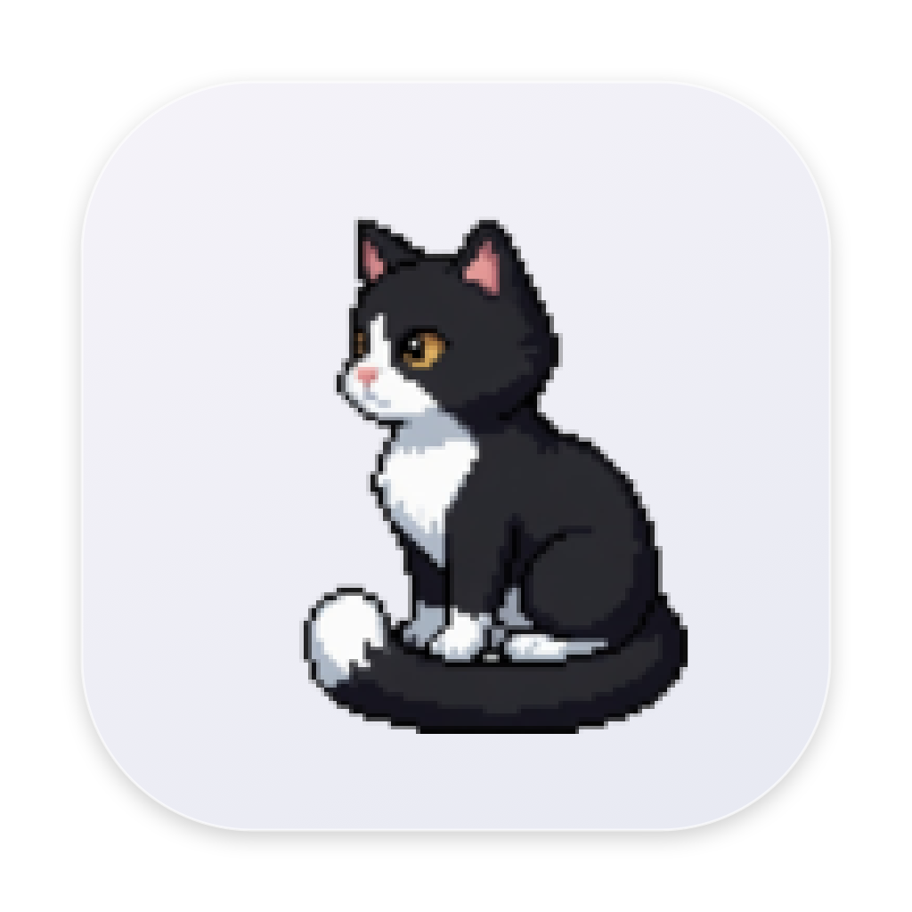
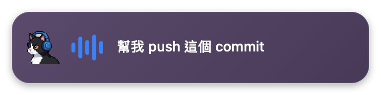
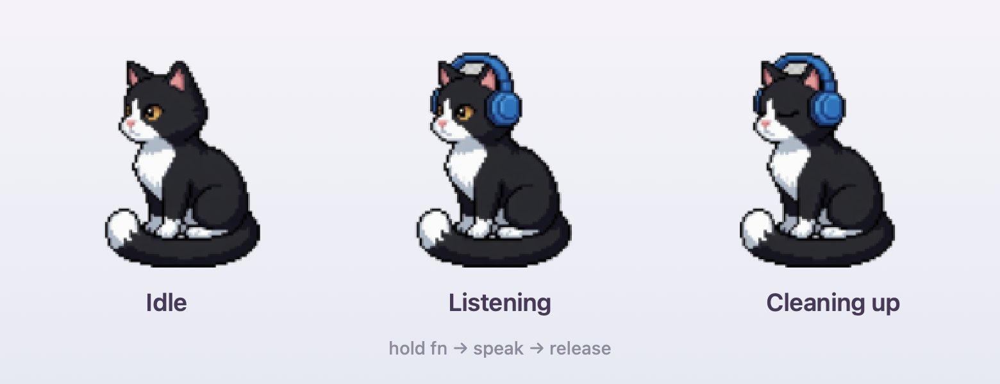
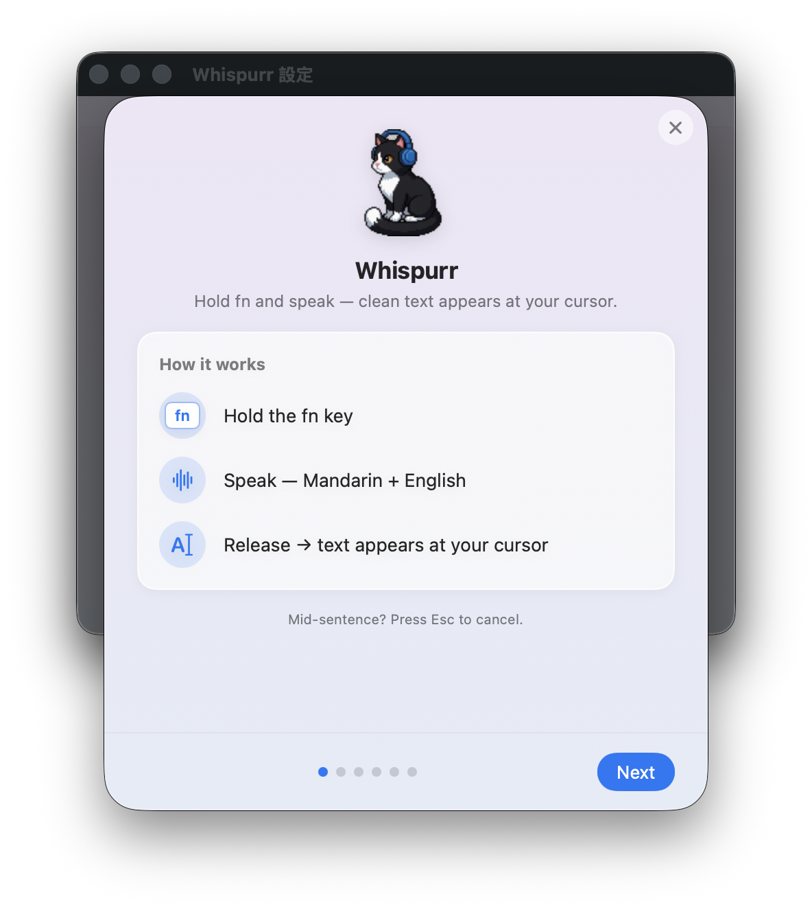
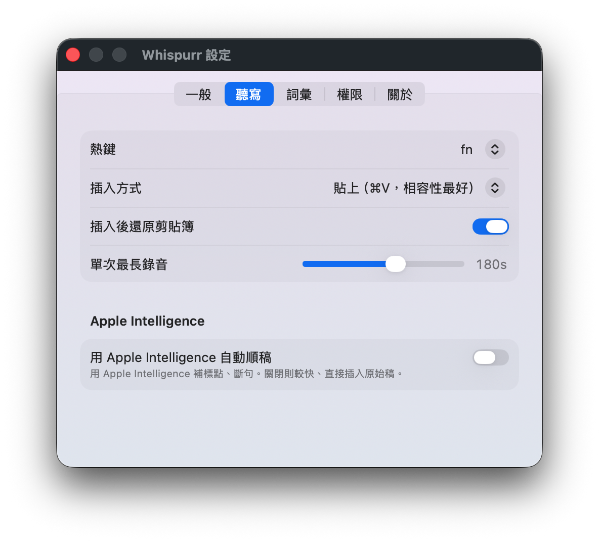

<p align="center">
  
</p>

<h1 align="center">Whispurr</h1>

<p align="center">
  一款在本機、<strong>完全離線</strong>的 macOS 選單列語音聽寫工具——中文&nbsp;+&nbsp;英文——<br>
  還有一隻會戴上耳機聆聽的像素燕尾貓。
</p>

<p align="center">
  <a href="README.md">English</a> · <strong>繁體中文</strong>
</p>

<p align="center">
  <a href="https://github.com/zhiii0x/whispurr/releases/latest"></a>
  <a href="https://github.com/zhiii0x/whispurr/releases/latest"></a>
</p>

<p align="center">
  
</p>

按住 **`fn`**，用中文夾雜英文技術詞彙說話，放開——你說的話會在**本機**辨識、在**本機**整理
（移除口頭禪、修正標點、保留英文詞彙、輸出繁體中文），然後插入到目前游標所在的任何 app。
沒有任何聲音或文字會離開你的 Mac。

---

## 快速開始

1. **[下載最新的 `.dmg`](https://github.com/zhiii0x/whispurr/releases/latest)** → 打開 → 把 **Whispurr** 拖進 Applications。
2. 啟動 **Whispurr**——它住在選單列。歡迎視窗會帶你完成四項權限（輸入監控、麥克風、語音辨識、輔助使用）。
3. **按住 `fn` 說話、放開。** 乾淨的文字會出現在游標處。按 **`Esc`** 取消這一次。

> 小技巧：到 **系統設定 → 鍵盤 →「按下 Globe 鍵時」**，選「**不執行任何動作**」，fn 才不會被 macOS 搶走。想用別的鍵？在設定裡選「右 Option」或「右 Command」。

本 app 經過 **Developer ID 簽章並由 Apple 公證**，所以 DMG 打開不會跳 Gatekeeper 警告。

<p align="center">
  
</p>

---

## 為什麼用 Whispurr

- **完全本機 / 離線。** 本機語音辨識 + 本機 LLM 整稿。無雲端、無帳號、無遙測。辨識出來的文字連系統 log 都不會寫入。
- **中英 code-switching 一等公民。** 「幫我 push 這個 commit」就是這樣——繁體中文，英文技術詞彙原樣保留。
- **永遠整理過的輸出。** Apple Intelligence 移除口頭禪（嗯／呃／um／uh）、修正標點、順過文法——只做編輯、絕不杜撰。（若 Apple Intelligence 關閉，則插入原始稿。）
- **按住說話（push-to-talk）。** 按住一個鍵、放開即插入。說話時浮動 HUD 顯示即時逐字稿。
- **討喜的選單列貓咪**，聆聽時戴上耳機、思考時閉上眼睛。
- **英文 / 中文介面**，可在設定切換（預設英文）。

---

## 螢幕截圖

<table>
<tr>
<td width="50%" valign="top">
  
  <p align="center"><em>首次啟動的權限引導</em></p>
</td>
<td width="50%" valign="top">
  
  <p align="center"><em>設定——熱鍵、插入方式、整稿、詞彙、語言</em></p>
</td>
</tr>
</table>

---

## 運作方式

```
fn > AudioCapture > SpeechTranscriber > TextCleanup > Vocabulary > TextInserter
 |      (麥克風)      (Apple, zh-TW)     (Foundation   (你的規則)    (貼上/輸入)
 |                                        Models)
 +------------- DictationCoordinator（狀態機）----------------+
                              |
                     選單列貓咪 + 浮動 HUD
```

- **辨識** — Apple `SpeechAnalyzer` / `SpeechTranscriber`（macOS 26），透過 contextual strings 偏向你的技術詞彙，跑在 Neural Engine 上。
- **整稿** — Apple `FoundationModels` 本機 LLM，使用嚴格的「只編輯」prompt、長度護欄（避免它「回答」你的口述），失敗時優雅退回原始稿。
- **插入** — 預設用剪貼簿 + 合成 Command-V（口述文字會標記為 transient/concealed，不會被 Universal Clipboard 同步、也不會被剪貼簿管理員收錄）；IME 敏感欄位可改用模擬輸入。
- **熱鍵** — 監聽用的 `CGEventTap`，所以即使在自繪 app（VS Code、Zed、Electron）裡也能觸發。

---

## 設定

| | |
|---|---|
| **語言** | 英文 / 中文（僅介面——口述輸出維持繁體中文）|
| **熱鍵** | fn、右 Option、右 Command |
| **插入方式** | 貼上（Command-V），或模擬輸入（不碰剪貼簿、適合 IME）|
| **整稿** | 開（Apple Intelligence）/ 關（原始稿、較快）|
| **詞彙** | 整稿後套用的 find/replace 規則（同時回饋給辨識器當提示）|
| **其他** | 提示音、開機自動啟動、單次最長錄音、插入後還原剪貼簿 |

---

## 系統需求

- **macOS 26（Tahoe）** 搭配 **Apple Silicon**
- 本機整稿需啟用 **Apple Intelligence**（選用——沒有的話會插入原始稿）
- 繁中語音模型於首次使用時下載一次（有進度條）

---

## 從原始碼建置

```sh
git clone https://github.com/zhiii0x/whispurr.git
cd whispurr
swift test           # 跑單元測試
swift run Whispurr   # 啟動選單列 app（按住 fn 聽寫）
```

診斷訊息會寫到統一日誌（不含逐字稿內容）：
`log stream --predicate 'subsystem == "nono.today.whispurr"'`

## 打包發行

```sh
# 本機 ad-hoc 簽章：
scripts/package.sh                            # -> dist/Whispurr.app

# Developer-ID 簽章 + 公證 + staple、含美化的 DMG：
SIGN_IDENTITY="Developer ID Application: ..." NOTARY_PROFILE=... \
MAKE_DMG=1 VERSION=0.1.0 scripts/package.sh   # -> dist/Whispurr-0.1.0.dmg
```

`scripts/make-icon.sh` 產生 app icon、`scripts/make-dmg.sh` 產生美化的安裝 DMG、`scripts/make-readme-assets.swift` 算出上面這些圖。Hardened-Runtime entitlements 在 `Whispurr.entitlements`；本 app **刻意不沙盒**（熱鍵與文字插入需要）。

---

## 架構

三層，透過 protocol 注入並有單元測試：

- **`WhispurrCore`** — 純邏輯：狀態機、設定、詞彙、逐字稿接合、logging。
- **`WhispurrPipeline`** — 系統整合：熱鍵、權限、音訊、辨識、整稿、插入、coordinator。
- **`WhispurrApp`** — AppKit 選單列 + SwiftUI 面板，從設定快照在 `AppAssembly` 組裝。

---

<p align="center"><sub>在 Apple M4 上打造 · 尚未採用開源授權——再利用前請先詢問。</sub></p>
